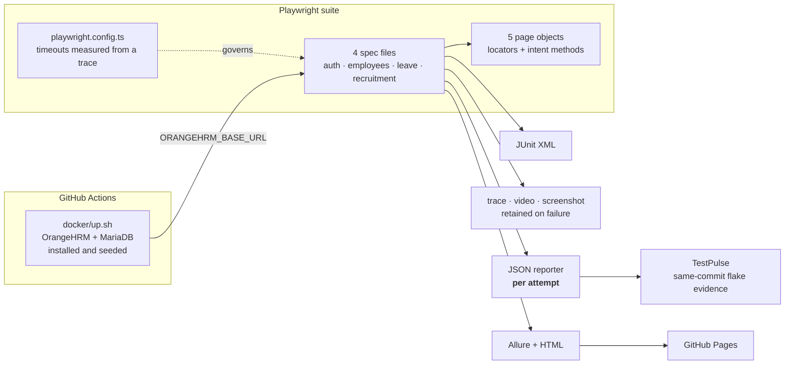

# OrangeHRM Playwright Automation
[](https://github.com/Mohanad49/orangehrm-playwright/actions/workflows/playwright.yml)

An end-to-end test automation framework built with [Playwright](https://playwright.dev/) and TypeScript, testing [OrangeHRM](https://www.orangehrm.com/) — run as a container in CI, with the [public demo](https://opensource-demo.orangehrmlive.com) as a zero-setup fallback.

**[Live Allure report →](https://mohanad49.github.io/orangehrm-playwright/)** ·
**[Flake history on TestPulse →](https://testpulse-eight.vercel.app/suites/orangehrm-e2e)**

## What this was proving

That an E2E suite against a real enterprise application can be trusted — meaning it fails
when the product is broken and not otherwise. Two things had to be true for that, and
neither is about Playwright:

1. **The app under test has to be mine.** It started against the public demo and it did
   not work; the details are below, and they took the suite from 2 of 18 passing to 18 of
   18.
2. **Flakiness has to be measured, not remembered.** Every run is ingested into TestPulse,
   so "is this test flaky" is a number over a rolling window rather than an opinion.

Current state over the last 50 runs: **18 tests, 98.6% pass rate, 1 test classified
flaky** — `Edit employee personal details → save → verify update`, a genuine occasional
save-then-read race sitting at 98%. Mean run wall-clock is 101 s and trending down about
5.5 s per run.

For how that compares against the Selenium suite this replaced — and why the honest answer
is "the framework is not what fixed the flakiness" — see
[MIGRATION.md in the predecessor repo](https://github.com/Mohanad49/open-source-webapp-qa-portfolio/blob/main/MIGRATION.md).

## Architecture



The edge worth pointing at is **JSON reporter → TestPulse**. `retries: 1` is set, and the
JSON reporter is the only one configured here that records each attempt separately. Allure
and HTML both collapse a retried test to its final verdict, which throws away the single
strongest piece of flakiness evidence a run can produce: *this test failed, then passed,
with the code unchanged*. Retries here are not a way of hiding flakiness — they are how it
gets recorded.

## ▶️ Running the tests

```bash
npm ci
npx playwright install --with-deps chromium

./docker/up.sh          # OrangeHRM + MariaDB, installed and seeded (~1 min)
npx playwright test     # 18/18, about a minute
```

`up.sh` is what CI runs. Without it the suite falls back to the public demo,
where several tests cannot pass — that instance accepts writes with `HTTP 200`
and then discards them. [docker/README.md](docker/README.md) has the full
account, and is probably the most interesting document in this repository.

## 🚀 Features

- **Page Object Model (POM)**: Highly maintainable and scalable architecture separating test logic from page interactions.
- **Enterprise Workflows**: Tests complex business logic including Employee Management, Leave Management, and Recruitment modules.
- **Dynamic Element Handling**: Robust handling of complex UI components like auto-suggest dropdowns and delayed DOM rendering.
- **Controlled Environment**: The app under test runs in Docker, installed and seeded from scratch on every run. It replaced the public demo after that instance turned out to discard writes silently and serve unrendered `${firstName}` placeholders — which took the suite from 2 of 18 passing to 18 of 18.
- **Allure Reporting**: Integrated with Allure for comprehensive, visual test execution reports.
- **TypeScript**: Strictly typed codebase for better tooling, refactoring, and error catching.

## 📂 Project Structure

```
orangehrm-playwright/
├── pages/                  # Page Object Models
│   ├── LoginPage.ts
│   ├── DashboardPage.ts
│   ├── EmployeeListPage.ts
│   ├── LeaveManagementPage.ts
│   └── RecruitmentPage.ts
├── tests/                  # End-to-End Test Suites
│   ├── auth/
│   │   └── login.spec.ts
│   ├── employees/
│   │   └── employee-management.spec.ts
│   ├── leave/
│   │   └── leave-management.spec.ts
│   └── recruitment/
│       └── recruitment.spec.ts
├── playwright.config.ts    # Playwright framework configuration
└── package.json            # Project dependencies and scripts
```

## 🧪 Test Coverage

The automation suite covers the following core modules:

1. **Authentication (`login.spec.ts`)**
   - Valid login flows
   - Invalid credential handling
   - Empty credential validation
   - Logout functionality

2. **Employee Management (`employee-management.spec.ts`)**
   - Creating new employee records
   - Editing personal details
   - Searching via dynamic autocomplete fields

3. **Leave Management (`leave-management.spec.ts`)**
   - Applying for specific leave types
   - Handling conditional UI states (e.g., users with zero leave balance)
   - Verifying leave entitlements and request cancellations

4. **Recruitment (`recruitment.spec.ts`)**
   - Adding new job vacancies
   - Managing hiring manager assignments
   - Editing and deleting vacancy records

## 🛠️ Technical Highlights

- **Smart Waits & Delays**: Uses `pressSequentially` with delays to simulate human input for triggering backend API calls in autocomplete fields.
- **State Verification**: Relies on data table verification rather than transient UI elements (like success toasts) for rock-solid assertions.
- **Playwright Trace Viewer**: Configured to capture screenshots, videos, and full DOM traces on test failures for rapid debugging.

## Structure, and the part of it I would change

Five page objects hold locators and intent-level methods; four spec files hold assertions.
Nothing in a spec file knows a CSS selector.

**Timeouts are measured, not guessed, and they live in one place.** A trace from a failing
CI run showed `/web/index.php/core/i18n/messages` returning 200 after **10.9 seconds**,
with the login POST itself taking 3.5 s. Against the original 30 s test timeout, a
`beforeEach` that navigates, logs in and waits for the dashboard had no headroom, so 16 of
18 tests failed in CI while all 18 passed locally. Nothing was wrong with the tests. The
current values are sized from that worst case with roughly 3× margin — not inflated until
things went green, because over-generous timeouts turn a hung page into a five-minute wait
and make a real regression look like a slow day. The page objects used to carry their own
10 s and 15 s literals, which is how a suite ends up with a dozen implicit answers to "how
long is this site allowed to take" and no way to change them together.

**What I would change: auth runs through the UI on every test.** Each spec has a
`beforeEach` that logs in by driving the login form. That is sixteen tests paying for a
precondition rather than testing one, and it is the single largest avoidable cost in the
suite. The fix is Playwright's `storageState` — authenticate once in a setup project, save
the session, and have every other test start already logged in. POM alone does not get you
that; it needs fixtures, and this suite does not use them yet. It is the first thing on
the list.
